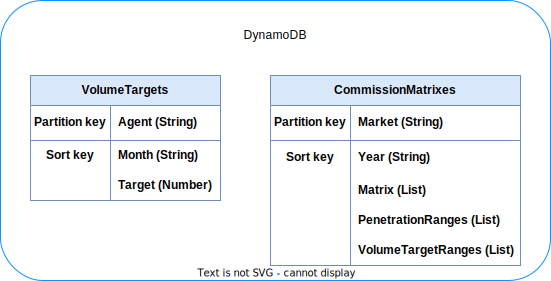

# bmw_analysis_and_design

## Database Design
Volume targets will be parsed into the VolumeTargets table and commission matrixes will be parseed into the ComissionMatrixes table.

## Questions
- Will there be multiple markets in volume targets?
- In the Matrix dummy data, will the penetration rate and volume targets be uploaded with it? This will allow for arbitrary commission matrix to be uploaded. Otherwise I need to know the percentages in advance. --> 
- Will the target volume be in USD?