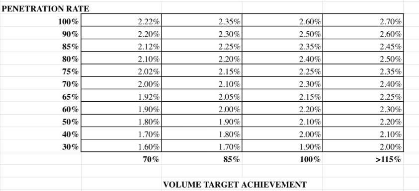
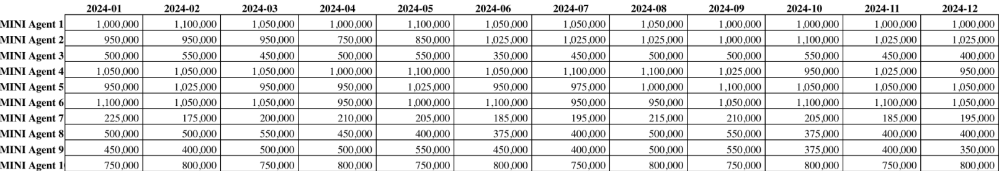
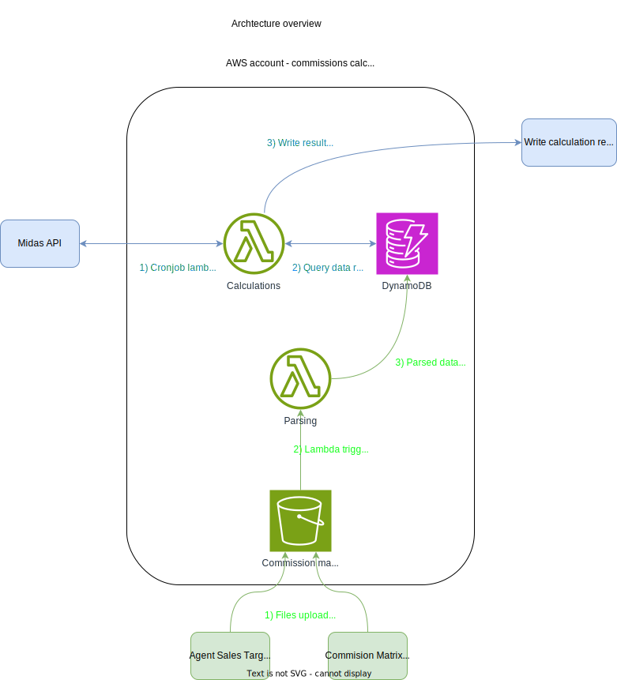
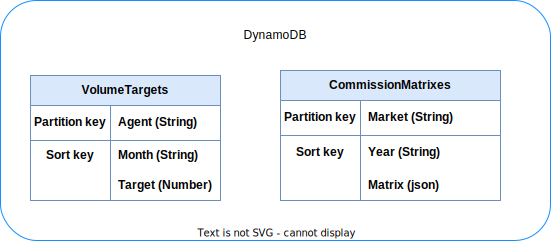

# Commission Calculation Microservice - Requirements, architecture, CI/CD, testing and timeline

## Introduction
This document serves as a proposed development guide for an automated system designed to manage and calculate sales commissions for BMW's sales agents. The purpose of this system is to simplify the current commission calculation process, reduce potential errors, and streamline the overall process.

The proposed system will leverage cloud technologies to ensure data is managed efficiently and securely. Additionally, the system is designed to integrate smoothly with BMW's existing data infrastructure, including the Midas API and CoreView platform, to facilitate seamless data flow and access.

The following sections will outline the detailed requirements, tools, and architecture for the system. They will provide insight into the functionalities it will offer, the technology stack it will use, the structure of its various components and a time estimation for the development process. Our goal is to provide BMW with a development plan for a reliable and efficient solution for commission management.

## Project requirements

### Functionality
- Upload Excel files containing Commission Matrices to AWS. This data should be easily accessible in order to do commission calculations. Should support overwriting of Matrices.
- Upload Excel files containing Agent Volume Target Sales data. Should support overwriting of agent sales targets.
- Montly read sales data from Midas API for the previous month, calculate the commission earned by agents, and write this data to CoreView.
- Montly read the clawback list, see if any of the contracts were cancelled within 6 months. If it was cancelled within 6 months, the commission that was paid for that contract should be nullified.

### Tools
- Github Actions for CI/CD (requirement BWM).
- Terraform for infrastructure (requirement BMW).
- Python will be used for lambda development since this project is mostly about data processing, which Python excels at.

### Throughput needs
- The files to be uploaded are relatively small. Lambda will be used for parsing.
- The data to be read and processed monthly from Midas is not very substantial. Lambda will be used for this as well.

### AWS components
AWS S3, Lambda, DynamoDB will cover the scalability and throughput needs of the product.

### Commission matrix file structure
This is how the Matrix data will be structured in Excel.



The placement of the matrix in the excel file should follow a standardised layout. A suggestion is that the first matrix should be placed in the top left corner, and every new matrix placed to the right of the previous matrix, with a blank column in between. Another option is a new matrix on every "page" of the excel document. The files should be uploaded in .xlsx format. The .xlsx files should follow a predetermined naming convention, in order to uniquely identify that the file is a Matrix file, and which year the matrices should apply to. I suggest matrix_yyyy.xlsx, but anything that follows the previously mentioned prerequisites should suffice.

### Sales volume targets file structure
This is how the Agent Sales Target Volumes data will look.



This looks pretty straight forward from a data processing perspective. The files should be uploaded in .xlsx format. As with the Matrix files, these files should follow a predetermined naming convention, in order to uniquely identify that the file is a Sales Target file, and which year it represents. I suggest sales_targets_yyyy.xlsx.

### Data needed from Midas

#### Commission calculation
To do the commission calculations the following data is needed from Midas:
- The total number of financed contracts per agent per market (total_number_of_financed_contracts).
- The total number of contracts per agent per market (total_number_of_contracts).
- Total financed sales volume per agent per market (financed_sales_volume_by_agent).

This is how the penetration rate is calculated:

```
penetration_rate = total_number_of_financed_contracts / total_number_of_contracts
```

This is how the target volume achieved is calculated:
```
target_volume_achieved = financed_sales_volume_by_agent / target_financed_sales_volume_by_agent
```

The rest of the data required for the commission calculation is pulled from DynamoDB (commission matrix and target financed sales volumes).

#### Clawback calculation
A clawback list will be fetched from Midas. The clawback lists contain a list of terminated contracts for the previous month. This list will be used to determine if there should be any clawbacks on previously issued commissions. 

### Midas
Data from Midas will be queried directly via standard SQL queries in Amazon Athena. I have not received any additional information regarding the database.

### Core View integration
There is an API which I will gain access to when the project starts.

## Architecture

### Overview
Event-driven serverless architecture will be used for all functionality. The functionality can be divided into two parts. The first part (green) involves uploading and parsing data. Here S3 will be used to upload and store Matrix and Sales Target files. Upon upload a lambda will parse the data in these files into DynamoDB according to the database schema. The second part (blue) involves reading data from an external AWS account, performing calculations on this data, and writing the result to CoreView.



### Calculation lambda
The calculation lambda should be triggered via a Cronjob at the first date of every month.

This should be done for every agent:
1. From Midas, retrieve all contracts sold by every agent last month. 
2. From DynamoDB, retrieve the Sales Target Data for this agent for last month.
3. Compute the penetration rate.
4. Compute the percentage of volume target achieved.
5. From DynamoDB, retrieve the commission matrix.
6. Compute the commission percentage.
7. Apply commission to all contracts.
8. Update CoreView with this new commission.

TODO: Add more details when I know how the structure of the data in Midas and API to use for CoreView.

#### Testing
All standalone classes and functions should be unit-tested.

The following test should be done programatically every time the code is deployed to AWS:
1. Initialize mock services for Midas, DynamoDB, and CoreView.
2. Trigger the Calculation Lambda with a simulated Cronjob.
3. Mock an API call to Midas and return representative data.
4. Check computation results for accuracy.
5. Mock the write to CoreView.
6. Confirm the correct updates are made to CoreView.
7. Use logs and metrics to validate the process and ensure no errors occurred.

Question: Should we set up a staging environment for CoreView so we can test the writes and not just mock it?

### Clawback lambda
The clawback lambda will be triggered by a Cronjob event the first day of every month. 

It will do the following:
1. Retrieve the clawback list from Midas.
2. Check if any of the cancelled contracts in the clawback list was cancelled within a 6 month period.
3. For all the contracts that were cancelled within a 6 month period, compute the added commission.
4. In CoreView, deduct the commission that agent earned from that contract.

#### Testing
The following test should be done programatically every time the code is deployed to AWS:

1. Trigger the clawback lambda with a simulated cronjob event.
2. Mock an API call to Midas and return representative data.
3. The lambda will check for contracts that was cancelled within a 6 month period, and deduct previously applied commission.
4. Mock the write to CoreView.
5. Verify that the lambda calculated the correct commission to deduct.
6. Use logs and metrics to validate the process and ensure no errors occurred.

Question: Should we set up a staging environment for CoreView so we can test the writes and not just mock it?

### Parsing lambda
The parsing lambda will be triggered via an S3 Event Notification which occurs when a file is uploaded to the S3 bucket. The lambda will identify if the uploaded file is a Commission Matrix file or a Target Sales Volume file. This will be done by checking the name of the file. Depending on if the file is a Commission Matrix file or a Target Sales Volume file, different flows will be executed.

#### Commission Matrix file
The matrix data will be loaded with Pandas.

For every Matrix in the data, the following instructions will be executed:
1. Extract the x-axis of the Matrix.
2. Extract the y-axis of the Matrix.
3. Extract the matrix itself.
4. Construct a DynamoDB item according to the database schema.
5. Write the item to DynamoDB.

#### Target Sales Volume file
The Target Sales Volume data will be loaded with Pandas.

For every record/row in the data the following instructions will be executed:
1. Construct an item for every monthly target of the agent in that record.
2. Write those items to DynamoDB using the BatchWriteItem method.

#### Considerations
Pandas is a big library. Lambda has some size limitations; 50MB zipped and 250MB unzipped. A lightweight version of Pandas might be needed; this can be acheived with lambda layers. If the standard Pandas package fits into the size requirements, it might still be a good idea to use lambda layers to increase deployment speed.

#### Testing
The following test should be done programatically every time the code is deployed to AWS:

1. Trigger Lambda by uploading a file to the S3 bucket.
2. Lambda parses the file, identifies type, and processes it.
3. Verify the correct DynamoDB item construction.
4. Check that the items are written to DynamoDB accurately.
5. Confirm that the correct flow is executed based on the file type.
6. Revert all the changes made to DynamoDB.
7. Remove the uploaded file.
8. Use logs and metrics to validate the process and ensure no errors occurred.

## Database design
Volume targets will be parsed into the VolumeTargets table. Commission matrixes will be parsed into the CommissionMatrixes table. Since the partition key does not uniquely identify an item, a composite key will be used. 



The actual matrix along with the x-axis and y-axis will be parsed into json. The x-axis refers to the penetration rate and y-axis refers to the sales volume target percentage. Below is an example of a parsed matrix:

```json
{
  "matrix": [
    [
      1.02,
      1.03,
      1.04,
      1.05
    ],
    [
      1.02,
      1.03,
      1.05,
      1.06
    ],
    [
      1.03,
      1.02,
      1.03,
      1.04
    ]
  ],
  "x-axis": [
    0.6,
    0.7,
    0.8,
    0.9
  ],
  "y-axis": [
    0.6,
    0.7,
    0.8,
    0.9
  ]
}
```

This would design would allow for easy parsing from DynamoDB into a Python Object representing the commission matrix and associated functionality:
```python
commission_matrix = CommissionMatrix.from_json(json)
commission = commission_matrix.compute_commission(penetration_rate, achieved_volume_percentage)
```

## CI/CD
BMW has finished deployment pipelines which are applicable to this project, so no new development should be needed here, only modifications of the provided workflows. Github actions will be used. Branching strategies, secret management and access control will be managed and set by BMW.

## AWS Infrastructure
All infrastructure will be written and configured with Terraform and deployed as part of the deployment pipelines.

Infrastructure to setup and configure:
- S3 bucket.
- DymamoDB.
- Parser labmda.
- Clawback lambda.
- Calculation lambda.
- VPC.
- Roles with least privilige access for each of the infrastructure resources.

## Time estimation

### Development and Configuration

- **Duration:** 8-9 weeks
- **Activities:**
  - Setup AWS account for dev.
  - Infrastrucutre as code with Terraform:
    - S3 bucket.
    - Calculation lambda.
    - Parsing lambda.
    - Clawback lambda.
    - DynamoDB.
    - IAM roles.
    - VPC.
  - Develop parsing lambda.
  - Develop clawback lambda.
  - Develop calculation lambda.
  - Develop Core View integration.
  - Write SQL for database schemas.
  - Unit testing.
- **Output:** Working AWS infrastructure.

### CI/CD Implementation

- **Duration:** 1 weeks.
- **Activities:** 
  - BWM will provide template CI/CD templates based on github actions, but I allocate some time to modify these and troubleshooting.
- **Output:** Fully working CI/CD pipelines.

### Testing

- **Duration:** Concurrent with Development - Adds and additonal 2-3 weeks.
- **Activities:**.
  - Integration tests.
  - Test end to end flow.
- **Output:** High test coverage and tested system.

### Deployment to Production

- **Duration:** 1 week
- **Activities:**
  - Deploy the solution to the production environment.
  - Perform final checks and validations.
- **Output:** Live system in production.

### Post-Deployment Monitoring and Optimization

- **Duration:** Ongoing
- **Activities:**
  - Monitor system performance and stability.
  - Optimize configurations for cost, performance, and security.
- **Output:** Optimized and stable production system.

### Time Estimation Summary

12-14 weeks.