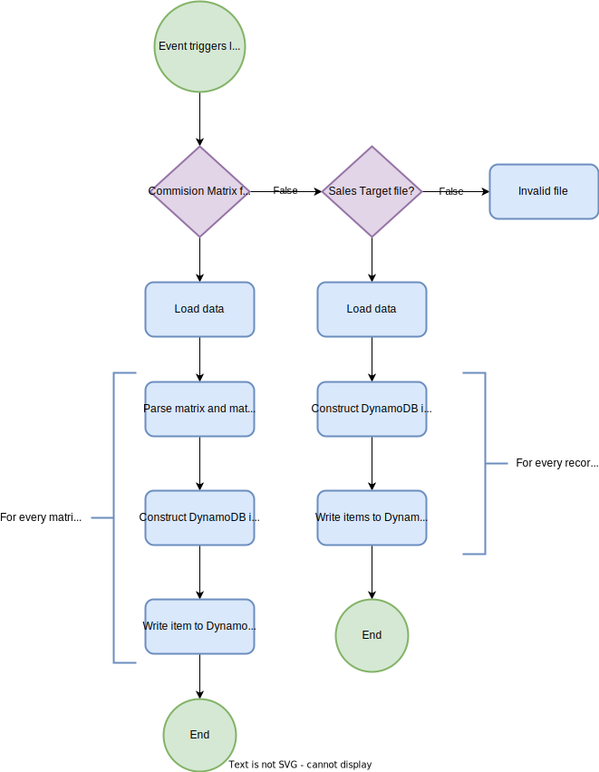

# bmw_analysis_and_design

## Project requirements
Tool requirements:
- Github Actions for CI/CD.
- Terraform for infrastructure.

Throughput needs:
Uploaded files are relatively small. Will read and write 
1. Requirement Gathering and Analysis
Duration: 1-2 weeks
Activities:
Define and document the project scope.
Does BMW have requirement for certain tools (e.g. programming language, CI/CD, CDK vs cloudformation)?
Understand the data formats, security requirements, and compliance needs.
Identify structure of incomming data from external AWS account.
Identify the structure and size of the data in the files to be uploaded.
Understand the scalability/throughput needs of the product.
Indentify AWS components and external integrations.
Core View does not seem to have its own API. Investigate how to interact with Core View.
Output: A detailed requirement document.

## Projects score
- Commission paid retroactively for the previous month based on penetration rate and volume sales target achievement.
- Clawback of mentioned commission if the contract was canceled within a 6 month period.
- The new commissions should be paid out for FSM contracts (excluding Staff & Service Loaner contracts (product), Internal BMW Group Staff contracts, Prolongation andTransfer of Contract).


## Architecture overview 


## Calculation lambda
The calculation labmda should be triggered via a cronjob at the first date of every month. 

**Data needed for commission caculcation:**
- Total sales for specific agents in every market for specific agents.
- Total sales for all agents combined in every market.

penetration_rate = sales_volume_by_agent / total_sales_volume
target_volume_achieved = sales_volume_by_agent / target_sales_volume_for_agent

Commission is calculated from the matrix by using penetration_rate and target_volume_achieved.

**Data needed for clawback calculations:**
- List of terminated contracts for the previous month.
- Commission the agent recieved for this contract (should be deducted if contract terminated within 6 months).

**Flow**
Get data from database:
- Get all delivered contracts
- Get all NSC Car sales.

## Midas API

## Core View integration

## Commission matrix file structure
This is how the Matrix data will be structured in Excel. 


What to decide on:
- Naming convention for matrix file (need to uniquely identify year and matrix file).
- File extention (.xlsx works fine). Anything that can be loaded with Pandas.
- Standardized Matrix placement in excel file. This could be one matrix per page, or every matrix separated by an empty column. Name of matrix market should be included in file.


## Sales volume targets file structure


## Parsing lambda
The parsing lambda will be triggered via an S3 Event Notificationm which occurs when a file is uploaded to the S3 bucket.



The lambda will:
- Identify if this file is a Comission Matrix file or a Target Sales Volum file. This will be done by checking the name of the file. It will follow a certain pattern depending on which file it is.
- Parse the data into DynamoDB.

**If it is an Comission Matrix file:**
1. Load the data from the file with Pandas.

For every Matrix in the data:
1. Extract PenetrationRate ranges, put them in a list and reverse the list (alternatively it is reversed after reading from DynamoDB by the calculation lambda).
2. Extract AgentSalesTargetRate ranges and put them in a list.
3. Extract the matrix as a list of lists.
4. Construct a DynamoDB item according to the database schema.
5. Write the item to DynamoDB.

**If it is an Target Sales Volume file**:
1. Load the data from the file with Pandas.

For every record/row in the data:
1. Construct an item for every montly target of the agent in that record.
2. Write those items to DynamoDB using BatchWriteItem.

## Database design
Volume targets will be parsed into the VolumeTargets table. Commission matrixes will be parseed into the CommissionMatrixes table. Since the partition key does not uniquely identify an item, a composite key will be used. 


The PenetrationRanges and VolumeTargetRanges attributes will be on the form
```python
ranges = [
    ["lower_bound_1", "upper_bound_1"],
    ["lower_bound_2", "upper_bound_2"],
    ["lower_bound_n", "upper_bound_n"],
]
```
Each range in the list representing a index to the right row or column in the matrix. The PenetrationRanges list will need to be reversed in order for the index or each range to represent the correct row in the matrix.


## Questions
- Will there be multiple markets in volume targets?
- In the Matrix dummy data, will the penetration rate and volume targets be uploaded with it? This will allow for arbitrary commission matrix to be uploaded. Otherwise I need to know the percentages in advance. --> 
- Will the target volume be in USD?